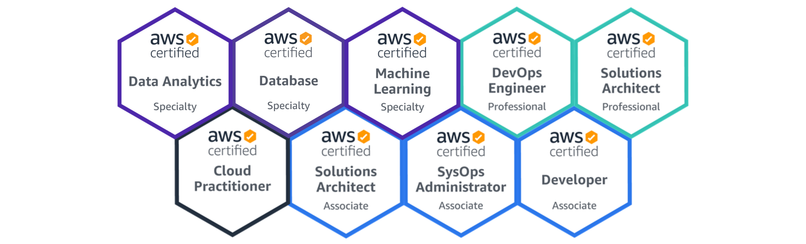

### Hello World, I'm Wojciech Gawroński - aka [AWS Maniac](https://awsmaniac.com/) 👋

 

  

## I'm Cloud, Serverless and Data Architect! :muscle:

- ☁ Co-founder of [Pattern Match](https://pattern-match.com/).
- 🔭 I enjoy solving complex data and serverless challenges on [AWS platform](http://aws.amazon.com).
- :pencil2: Blogging and sharing knowledge regularly on [the blog](https://awsmaniac.com) and [YouTube channel](https://www.youtube.com/channel/UCGpHK4MYiIMbyJt7TOkcp5Q).
- :computer: Functional programmer by heart and soul ([Erlang](https://www.erlang.org/), [Elixir](https://elixir-lang.org/), [Clojure](https://clojure.org/)).
- 📫 How to reach me: [you can find details here](https://awsmaniac.com/contact/).
- 😄 Pronouns: he/him/his
- 🌱 Currently working on enhancing my expertise with [Rust](https://www.rust-lang.org).
- 🏆 Member of the [*AWS Community Builders*](https://aws.amazon.com/developer/community/community-builders/) program.
- 🎖 8x [AWS Certified Expert](https://www.youracclaim.com/users/afronski/badges).
- 👨‍🏫 Teacher at [NatywnaChmura.pl](https://natywnachmura.pl/).

